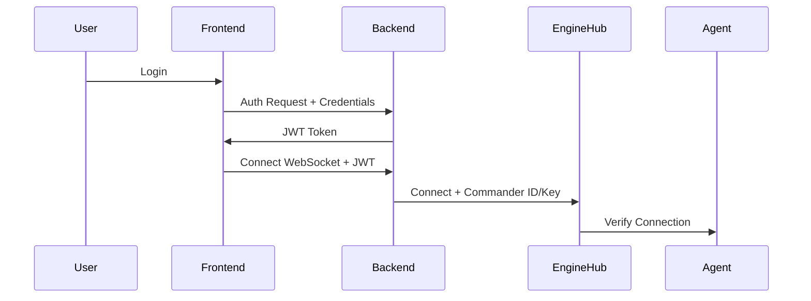
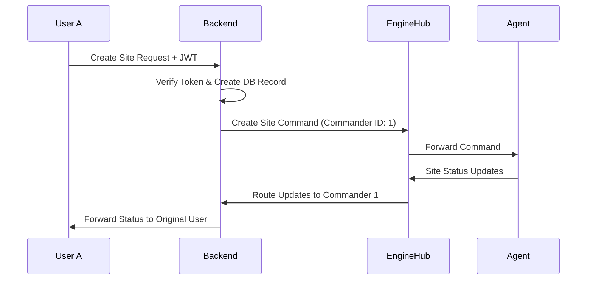

# WebSocket Security and Message Routing

## Overview

The Citrus Host platform implements a secure WebSocket communication system that ensures:
1. Only authenticated users can create and manage sites
2. Users can only access and modify their own sites
3. WebSocket messages are properly routed between users, agents, and the backend

## Architecture Components

### 1. Authentication Layer
- Frontend authentication using JWT tokens
- Backend token verification on both REST and WebSocket connections
- Agent authentication using unique agent IDs and keys



### 2. Site Operation Security

#### Database Level Security
```sql
-- Sites table includes user_id for ownership
CREATE TABLE sites (
    id SERIAL PRIMARY KEY,
    name VARCHAR(255) NOT NULL,
    url VARCHAR(255) NOT NULL,
    user_id INTEGER NOT NULL,
    created_at TIMESTAMP DEFAULT CURRENT_TIMESTAMP,
    updated_at TIMESTAMP DEFAULT CURRENT_TIMESTAMP,
    deployer_id VARCHAR(255),
    deploy_status VARCHAR(50),
    last_deploy_date TIMESTAMP,
    FOREIGN KEY (user_id) REFERENCES users(id)
);
```

#### API Level Security
- All site operations require a valid JWT token
- Token contains user ID which is used to verify site ownership
- Site queries are automatically scoped to the authenticated user

## Message Routing Flow

### 1. Creating a Site



### 2. Message Tracking System

The system maintains message ownership through:

1. **Commander ID Tracking**
```javascript
// In EngineHub
handleCommanderMessage(commanderId, data) {
  // Forward message to agent with commander ID
  agentWs.send(JSON.stringify({
    ...message,
    commanderId // Track who initiated the command
  }));
}
```

2. **Response Routing**
```javascript
// In EngineHub
handleAgentMessage(agentId, data) {
  const message = JSON.parse(data);
  // Add to queue with originating agent ID
  this.inboundQueue.enqueue(message, agentId, priority);
}
```

### 3. Security Measures

#### Cross-User Protection
1. Database Level
```typescript
// All site queries include user_id check
router.get('/sites', verifyToken, async (req, res) => {
  const userId = req.user?.id;
  const result = await pool.query(
    'SELECT * FROM sites WHERE user_id = $1',
    [userId]
  );
});
```

2. WebSocket Level
```typescript
// Messages are scoped to specific commanders
broadcastToCommanders(message) {
  // Only commanders who initiated the command receive updates
  this.commanders.forEach((ws, commanderId) => {
    if (commanderId === message.commanderId) {
      ws.send(messageStr);
    }
  });
}
```

#### Agent Security
1. Agent Authentication
```javascript
async verifyAgent(agentId, agentKey) {
  const response = await axios.post(`${this.commanderUrl}/api/verify-agent`, {
    agentId,
    agentKey
  });
  return response.data.valid;
}
```

2. Command Validation
```javascript
// Agents only accept commands from verified commanders
handleMessage(message) {
  if (!this.verifyCommanderAccess(message.commanderId)) {
    return;
  }
  // Process command
}
```

## Security Best Practices

1. **Token Management**
   - JWTs expire after a short period
   - WebSocket connections require re-authentication
   - Agent keys are rotated periodically

2. **Message Validation**
   - All messages are validated for proper structure
   - Commands are checked against allowed operations
   - User permissions are verified for each operation

3. **Error Handling**
   - Failed operations are logged and monitored
   - Error messages don't expose system details
   - Rate limiting prevents abuse

## Example: Preventing Unauthorized Access

If User B tries to modify User A's site:

1. **REST API Level**
```typescript
// The user_id check prevents access
router.put('/site/:id', verifyToken, async (req, res) => {
  const userId = req.user?.id;
  const site = await getSite(req.params.id);
  
  if (site.user_id !== userId) {
    return res.status(403).json({
      success: false,
      message: 'Unauthorized access'
    });
  }
  // Process update
});
```

2. **WebSocket Level**
```javascript
// Messages are only routed to the original commander
handleAgentMessage(agentId, data) {
  const message = JSON.parse(data);
  // Only the commander who initiated the operation receives updates
  const targetCommander = this.commanders.get(message.commanderId);
  if (targetCommander) {
    targetCommander.send(JSON.stringify(message));
  }
}
```

## Monitoring and Auditing

1. **Message Logging**
   - All WebSocket messages are logged with metadata
   - Commander and agent actions are tracked
   - Security events are monitored

2. **Audit Trail**
   - Site operations are recorded in the database
   - User actions are timestamped and logged
   - Security incidents are flagged for review 